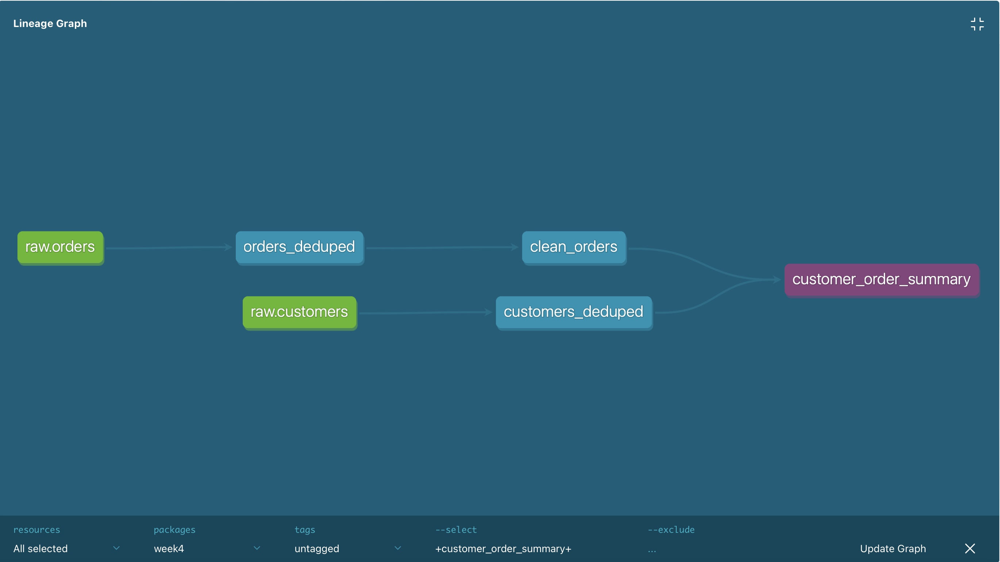
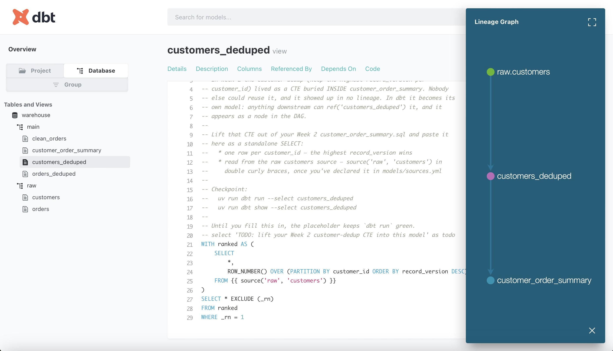

## Project summary

Ported a hand-rolled DuckDB + Python SQL pipeline (Week 2) into **dbt**: raw
order and customer data flows through `source()`-declared inputs, staged
dedup/cleaning models, and a final mart — all wired together with `ref()`
instead of hard-coded table names, so dbt derives the build order and draws
the dependency graph below on its own. Money parsing, three-format date
parsing, and the customer/order dedup logic (`ROW_NUMBER()` + `QUALIFY`-style
filtering) carried over unchanged; what's new is that every model is now
independently testable (`not_null` / `unique` data tests on primary keys),
independently buildable (`dbt run --select <model>`), and documented in a
generated docs site with full column-level lineage.

<p align="center">
  
</p>

<p align="center">
  
</p>

**Stack:** dbt-core + dbt-duckdb, Jinja (`source()` / `ref()` / `var()`), DuckDB, `uv`

---

# Week 4 — Same SQL. Grown-Up Tooling.

In Week 2 you wrote real SQL against messy data: window-function dedup, money
cast from text, three date formats, the NULL-join trap. That SQL was *correct* —
but it lived in Python strings and `.sql` files that only ran in the exact order
your script called them, with no lineage, no tests on the data, and no docs.

This week you don't write new SQL. You take **the exact SQL you already wrote**
and move it into **dbt** — the industry-standard way to run the "T" in ELT —
and watch what the framework gives you for free: a dependency graph, compiled
SQL you can read, data tests, and a documentation site.

```
 data/source/            data/warehouse.duckdb                dbt (your week)
┌────────────────┐ load ┌───────────────┐   dbt run   ┌───────────────────────────┐
│ orders.csv     │ ───► │ raw.orders    │ ──────────► │ orders_deduped     (view) │
│ customers.json │      │ raw.customers │             │ customers_deduped  (view) │
└────────────────┘      └───────────────┘             │ clean_orders       (view) │
 (same Week 2 mess)      (loaded AS-IS,               │ customer_order_summary    │
                          this is dbt's               │                   (table) │
                          starting line)              └───────────────────────────┘
                                                       sources · refs · tests · docs
```

**No Docker and no S3 this week — that's the point.** dbt doesn't fetch or load
anything. It assumes data is already *in* the warehouse and transforms it from
there. A provided script plays the role your Week 2 pipeline played.

This repo is intentionally left in a failing starter state. The models and a
subset of the tests are there to guide you, but they are not complete until you
fill them in. If you run `uv run dbt build` before finishing the week, it should
fail for exactly the missing work.

## What's in this repo

| Path | What it is |
| --- | --- |
| `dbt_project.yml` | The dbt project: name, paths, materializations. **Provided — read it Day 1.** |
| `profiles.yml` | How dbt connects (a local DuckDB file). **Provided — read it Day 1.** |
| `scripts/generate_data.py` | Generates the same messy Week 2 source data. **Provided.** |
| `scripts/load_raw.py` | Loads it into DuckDB as `raw.orders` / `raw.customers`. **Provided.** |
| `models/staging/orders_deduped.sql` | **Day 1** — your first model. Port your Week 2 dedup here. |
| `models/sources.yml` | **Day 2** — declare the raw tables as dbt sources. |
| `models/staging/customers_deduped.sql` | **Day 2** — the dedup CTE, promoted to a model. |
| `models/staging/clean_orders.sql` | **Day 2** — your Week 2 cleaning, now with `ref()`. |
| `models/marts/customer_order_summary.sql` | **Day 2** — join + aggregate; `var('min_orders')`. |
| `models/schema.yml` | **Day 3** — data tests + descriptions. |
| `DECISIONS.md` | **Day 3** — defend your choices in writing. |

**Bring your Week 2 repo.** Your `sql/` files and `transform.py` from Week 2 are
your raw material — have them open in another window all week.

## One-time setup

You need [`uv`](https://docs.astral.sh/uv/). No Docker this week. Do these
**in order** and confirm each before moving on.

```bash
uv sync                                   # 1. create the environment (.venv/)
uv run python scripts/generate_data.py    # 2. generate the messy source data
uv run python scripts/load_raw.py         # 3. load it into DuckDB, as-is
uv run dbt debug                          # 4. dbt checks project + connection
uv run dbt run                            # 5. first run — 4 placeholder models build
```

> _Confirm step 3:_ it prints row counts and notes that row count > distinct
> count *on purpose* — the same duplicate mess as Week 2.
> _Confirm step 4:_ ends with **All checks passed!** That means dbt found
> `dbt_project.yml`, matched it to `profiles.yml`, and connected to DuckDB.
> _Confirm step 5:_ `Completed successfully` with 4 models. They're TODO
> placeholders — turning them real is the week.

### VS Code

Say yes to the recommended extensions (Python + **Ruff**). If you want SQL
highlighting inside `{{ }}`, the *dbt Power User* extension is nice but
optional — everything this week works from the terminal.

## The dbt mental model (read this before Day 1)

Five ideas, and you know three of them already:

1. **A model is one SELECT in one file.** The file name becomes the table/view
   name. You wrote these in Week 2 — they just had `CREATE TABLE` around them.
2. **Materialization is config, not code.** *You* write what the data should
   be; `dbt_project.yml` decides view vs table. The DDL you wrote by hand in
   Week 2 is now dbt's job.
3. **`source()` names data dbt didn't build. `ref()` names data dbt did.**
   Together they replace every hard-coded table name — and because dbt sees
   every `ref()`, it *derives* the dependency graph and runs models in the
   right order. In Week 2, the "graph" was the order of lines in `pipeline.py`.
4. **Tests are assertions about data.** `not_null`, `unique`, one line of YAML
   each. `dbt test` compiles them to SQL that hunts for violations.
5. **dbt compiles, the warehouse computes.** dbt turns Jinja + SQL into plain
   SQL (you can read every compiled file in `target/`) and ships it to DuckDB.
   dbt itself never touches a row.

## The week, day by day

**The rhythm: port a transform → `dbt run` → look at what got built → move on.**

### Day 1 — dbt init + your first model

1. **Read the two config files** — `dbt_project.yml` and `profiles.yml`, top to
   bottom. They're short and heavily commented. Know which one owns *what the
   project is* vs *where it connects*.
2. **Port `orders_deduped`.** Open `models/staging/orders_deduped.sql` and
   follow the header: paste your Week 2 dedup SQL, drop the DDL, point it at
   `raw.orders`.
   ```bash
   uv run dbt run
   uv run dbt show --select orders_deduped        # peek at real rows
   ```
3. **Prove the dedup worked** — same bar as Week 2: one row per `order_id`.
   ```bash
   uv run dbt show --inline "select count(*) n, count(distinct order_id) d from orders_deduped"
   ```
   `n` = `d` or the dedup isn't done. Compare both to what `load_raw.py` printed.
4. **Notice what you didn't do:** no connection code, no `CREATE OR REPLACE`,
   no execution order to manage. That's the trade you're evaluating this week.

### Day 2 — sources, refs, and why dbt won

1. **Declare the sources.** Finish `models/sources.yml` (orders is the worked
   example; you add customers). Then swap `orders_deduped`'s hard-coded
   `raw.orders` for `{{ source('raw', 'orders') }}`.
   ```bash
   uv run dbt run          # still green — same SQL, now declared
   ```
2. **Port the other three models** — follow each file's header, in this order:
   `customers_deduped` (the CTE from Week 2 gets its own model), `clean_orders`
   (reads `{{ ref('orders_deduped') }}`), `customer_order_summary` (refs both;
   Week 2's `$min_orders` bound parameter becomes `{{ var('min_orders') }}`).
   ```bash
   uv run dbt run
   uv run dbt run --vars 'min_orders: 5'    # the parameter, dbt-style
   ```
3. **Read the compiled SQL.** This is the "dbt is not magic" moment:
   ```bash
   uv run dbt compile
   ```
   Open `target/compiled/week4/models/marts/customer_order_summary.sql`. Every
   `ref()`, `source()`, and `var()` is gone — it's the plain SQL you could have
   written by hand. dbt is a compiler with opinions, not a database.
4. **See the graph you never wrote.** dbt derived the execution order from your
   `ref()` calls:
   ```bash
   uv run dbt ls                                   # everything dbt knows about
   uv run dbt run --select orders_deduped+         # a node and everything downstream
   ```
   In Week 2, "run things in the right order" was your job. Now it's derived.

### Day 3 — tests, deliberate breakage, and docs

1. **Start from the failing contract.** The starter repo is intentionally not
   done. The tests in `models/schema.yml` are already active and should fail
   until the work is implemented. Read the failing checks, then fix the models
   and add the remaining assertions only where the TODOs call for them.
   ```bash
   uv run dbt test
   ```
2. **Break it. On purpose.** Comment out the row filter in `orders_deduped`
   (the `WHERE rn = 1` or your `QUALIFY`) so duplicates flow through again:
   ```bash
   uv run dbt run && uv run dbt test
   ```
   Watch the failing unique test with a violation count. Open the compiled test
   under `target/compiled/` and run its SQL with `dbt show --inline` to *see*
   the offending rows. Restore the filter, get back to green. This is the
   data-quality story: the bug that silently doubled numbers in Week 2 is now a
   one-line contract that fails loudly.
3. **Generate the docs site.**
   ```bash
   uv run dbt docs generate
   uv run dbt docs serve          # opens http://localhost:8080
   ```
   Find your model descriptions, click a model, and open the lineage graph
   (bottom-right icon): green sources → staging → mart. That DAG is the diagram
   at the top of this README — except dbt drew it from your code.
4. **The final gate** — build + test everything in DAG order, one command:
   ```bash
   uv run dbt build
   ```
5. **Defend your choices.** Fill in `DECISIONS.md`.

## Working commands

```bash
uv run dbt run                             # build all models
uv run dbt run --select clean_orders      # build one model
uv run dbt test                            # run all data tests
uv run dbt build                           # run + test, DAG order (the final gate)
uv run dbt show --select <model>           # peek at a model's rows
uv run dbt compile                         # write compiled SQL to target/
uv run dbt docs generate && uv run dbt docs serve
```

## How you'll know you're done

`uv run dbt build` is green — all 4 models built AND every test passing — the
docs site shows your lineage graph with descriptions filled in, and
`DECISIONS.md` is done. Bonus check: `customer_order_summary` numbers match
what your Week 2 pipeline produced. Same data, same SQL — it should.

## Troubleshooting

- **`dbt debug` can't find the project** — run every `dbt` command from the
  repo root (where `dbt_project.yml` lives).
- **`Catalog Error: Table ... raw.orders does not exist`** — setup steps 2–3
  didn't happen. Generate, then load, then run.
- **`IO Error: ... database is locked`** — something else has
  `data/warehouse.duckdb` open (a Python REPL, a DB viewer, `dbt docs serve`).
  DuckDB allows one writer at a time; close the other thing.
- **`Compilation Error: model '...' depends on ... which was not found`** — a
  `ref('...')` doesn't match a model *file name* exactly. The string inside
  `ref()` is the file name without `.sql`.
- **Your Week 2 SQL errors under dbt** — remember: no `CREATE`/`DROP`
  statements, no trailing semicolon needed, one SELECT per model. And it's the
  same DuckDB dialect, so `TRY_CAST` / `TRY_STRPTIME` all still work.
- **Tests pass when you expected failure** — did you `dbt run` after the edit?
  Tests check the *built* object, not your `.sql` file.
- **Windows** — if VS Code doesn't pick up the env, Command Palette → *Python:
  Select Interpreter* → the one under `.venv`.

